# aws-cicd-lambda-sns-chatbot-slack 🐳


[](https://github.com/tquangdo/aws-cicd-lambda-sns-chatbot-slack/issues/new)

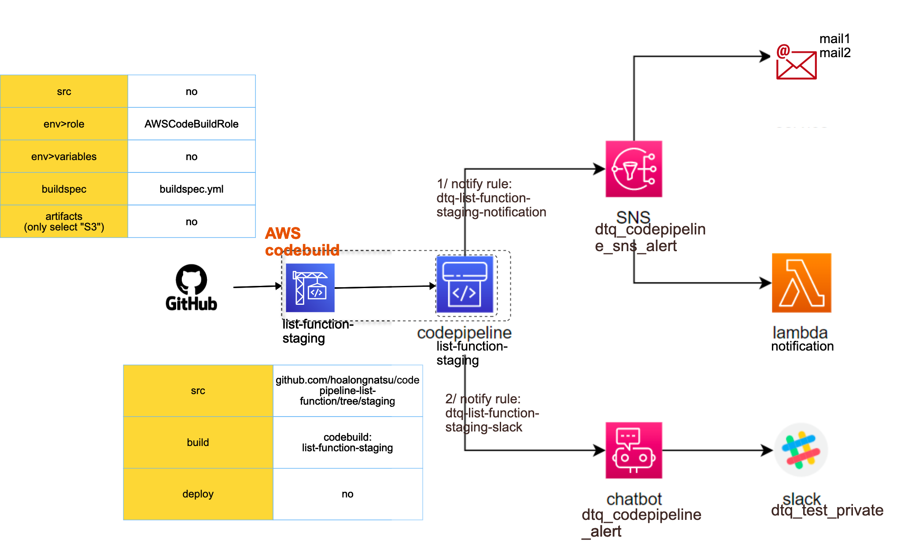

## reference
[viblo](https://viblo.asia/p/serverless-series-golang-bai-9-codepipeline-notification-with-aws-chatbot-and-aws-sns-4P856GB9KY3)

## terraform
```shell
terraform init
terraform apply -auto-approve
```
-> will show ouput of `terraform-start/main.tf`
```js
output "base_url" {
  value = {
    api_staging    = aws_api_gateway_deployment.staging.invoke_url
    api_production = aws_api_gateway_deployment.production.invoke_url
  }
}
```
- access `https://0ix8dlofgb.execute-api.us-east-1.amazonaws.com/staging/books` on browser:
```json
{
  id: "1",
  name: "Go in Action",
  author: "Erik St. Martin Foreword",
  image: "https://images-na.ssl-images-amazon.com/images/I/41ADgj-CvsL._SX397_BO1,204,203,200_.jpg"
}
```

## AWS SNS
- topic name=`dtq_codepipeline_sns_alert`
- 2 subscriptions with protocol=
1. email=`mail1`
2. lambda=`notification`
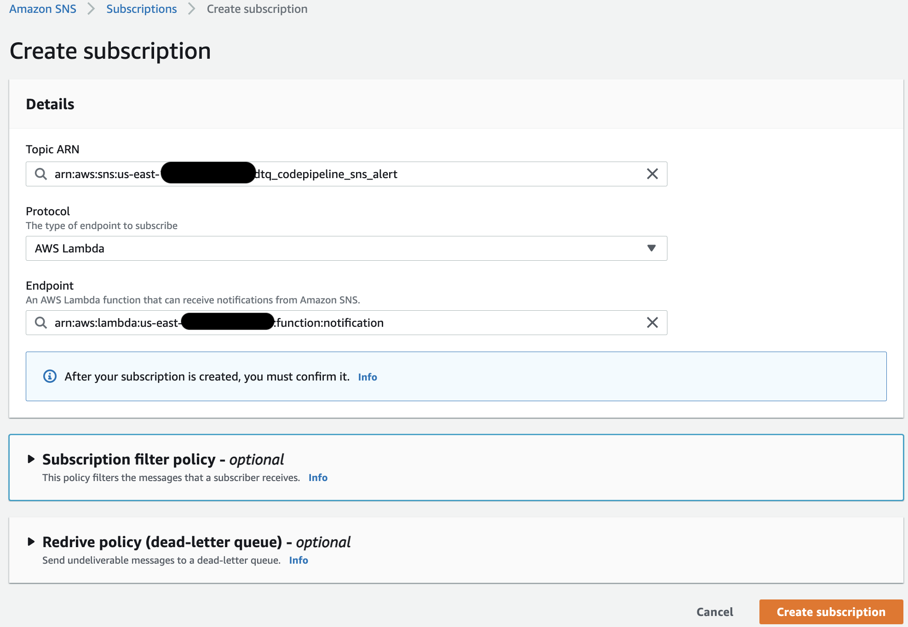

## AWS Pipeline
- pipeline `staging`
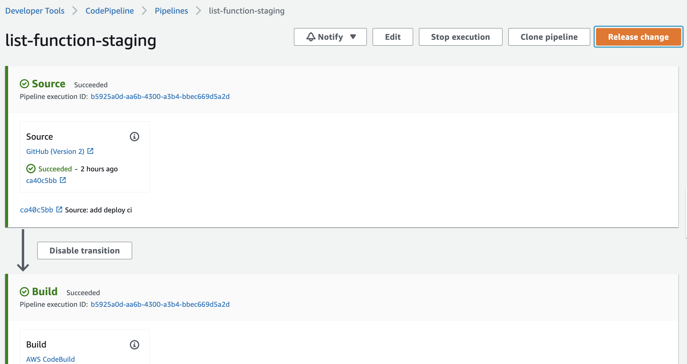
- src stage: from `https://github.com/hoalongnatsu/codepipeline-list-function/tree/staging`
> src code: `terraform-start/codepipeline_list_function.tf`
```js
      configuration = {
        ConnectionArn    = var.codestar_connection
        FullRepositoryId = "hoalongnatsu/codepipeline-list-function"
        BranchName       = "staging"
      }
```
- select Notify => `Create notification rule`
- notification name=`dtq-list-function-staging-notification`
- target: select `dtq_codepipeline_sns_alert`
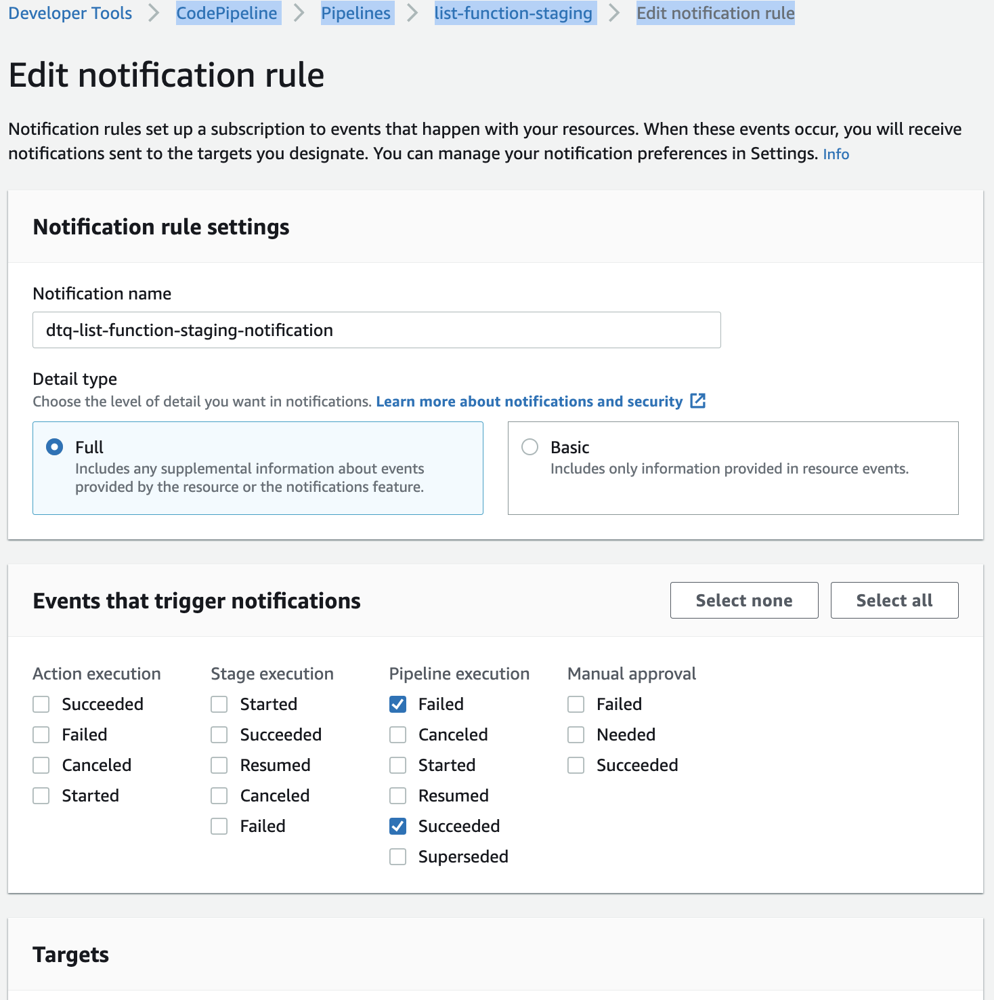
- click `Release change`
- at 1st, pipeline auto run result will send mail to `mail1`
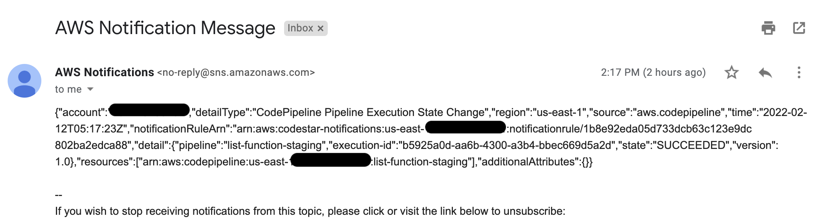

## AWS Lambda
- after add subscription 2, add env variables with `mail2`:
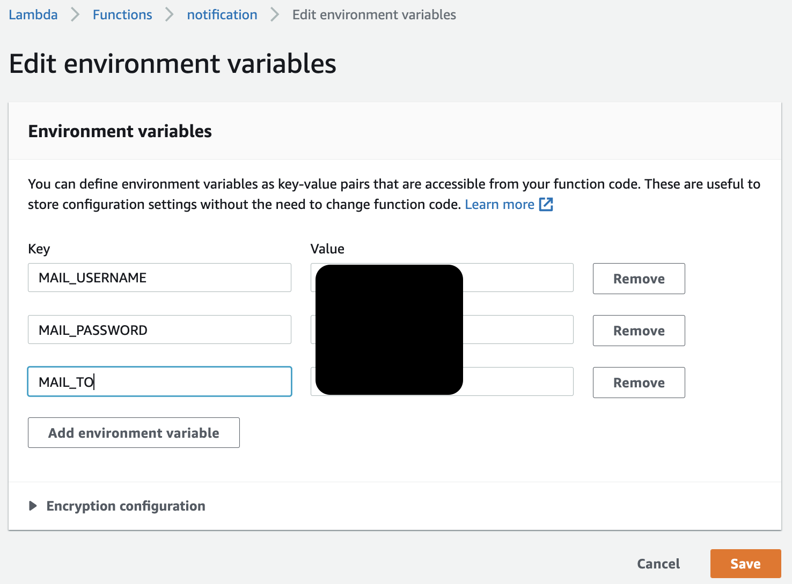
> need edit secure of `mail2`
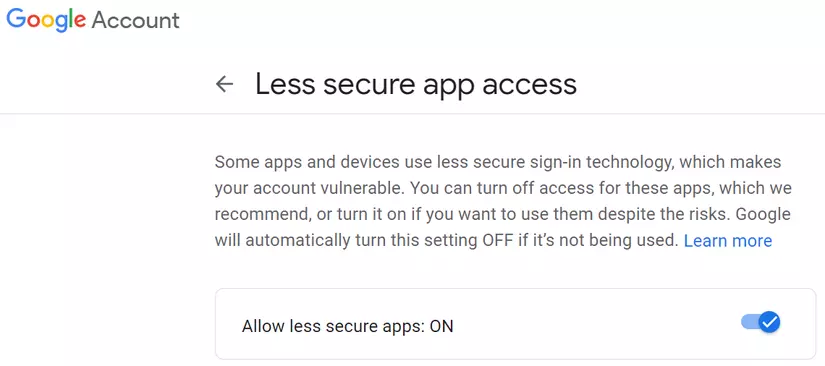

## test `mail2`
- pipeline `staging` > click `Release change`
- besides send to `mail1` like 1st, in 2nd also will send to `mail2`

## AWS Chatbot
- select `slack` > click `Configure new client`
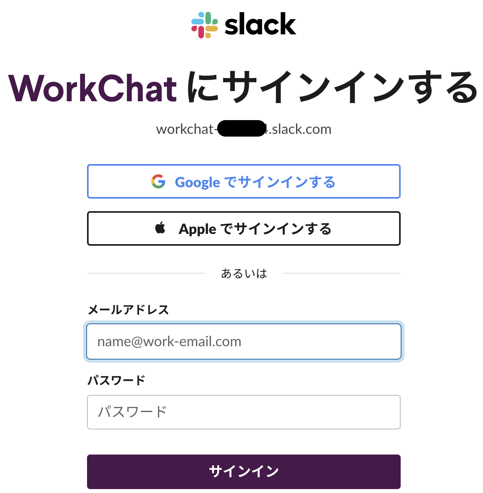
---
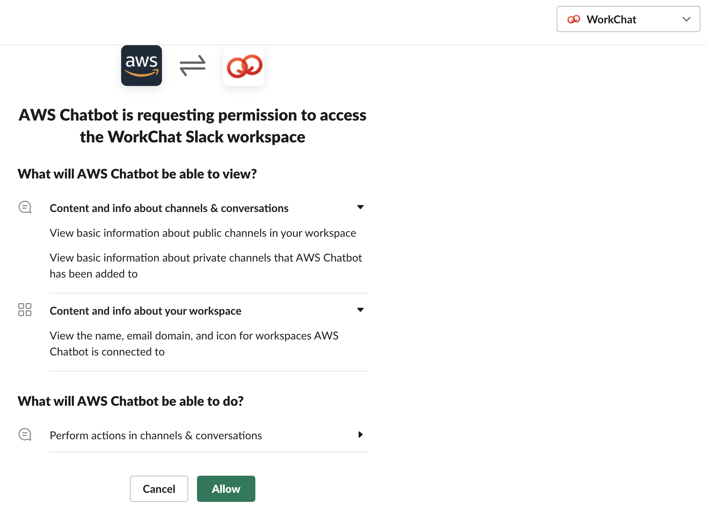
- click `Configure new channel`
- configuration name=`dtq_codepipeline_alert`
- role name=``DTQ-AWSCodeStarNotifications-Chatbot-Slack-Role
- Policy templates select `Notification permissions` & Channel guardrails select `AWSCodepipelineFullAccess`
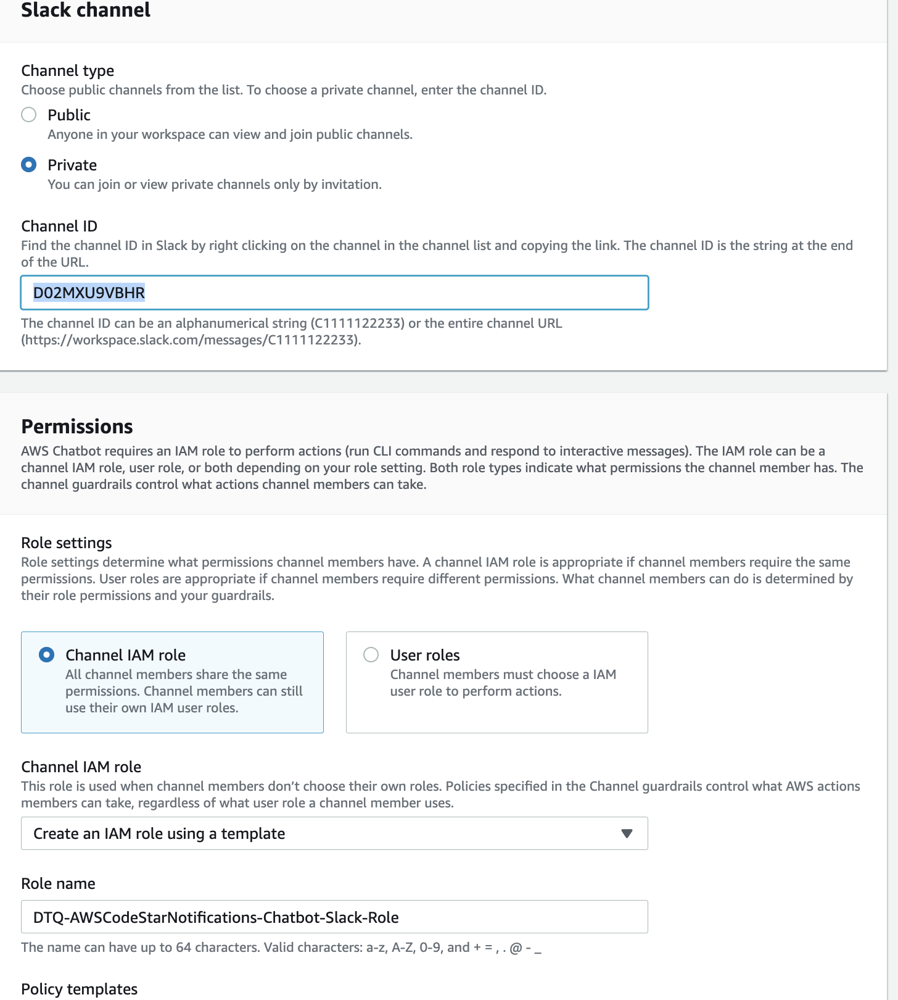

## Slack
- select private channel=`dtq_test_private` (NOT yourself channel!!!)
- add app=`AWS Chatbot` to `dtq_test_private`
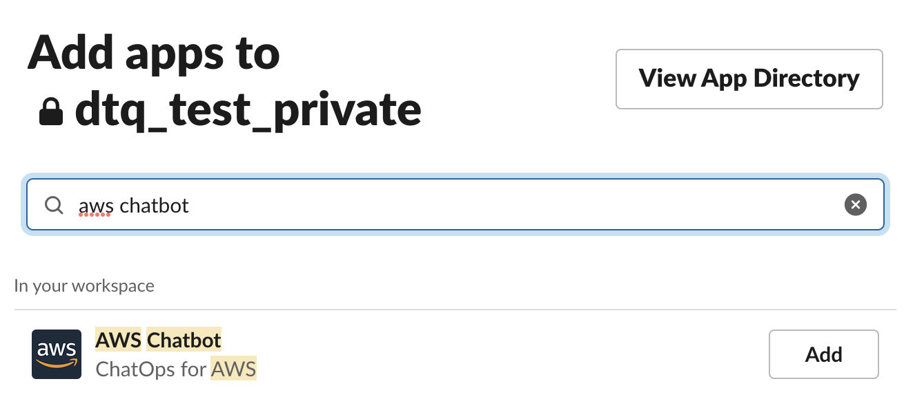
---
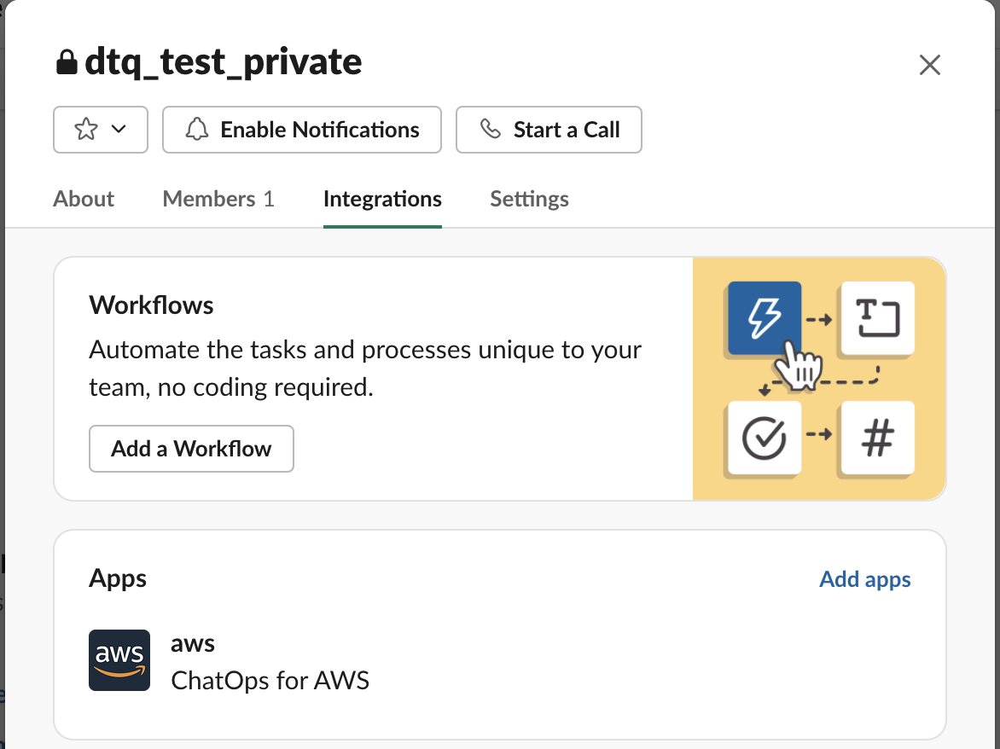

## AWS Pipeline
- select Notify => `Create notification rule`
- notification name=`dtq-list-function-staging-slack`
- target: select AWS Chatbot(Slack)=`dtq_codepipeline_alert`
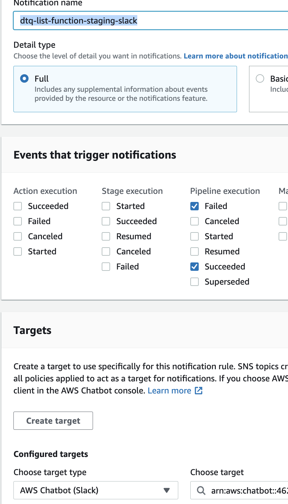

## last test
- pipeline `staging` > click `Release change`
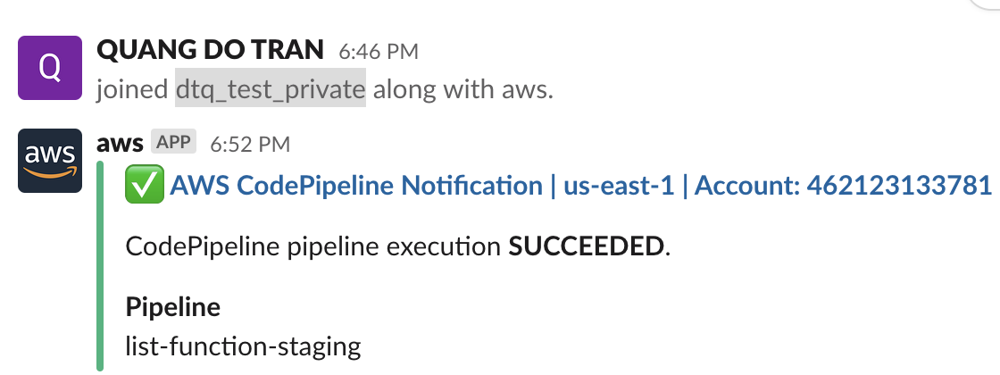

## terraform
```shell
terraform destroy -auto-approve
```


